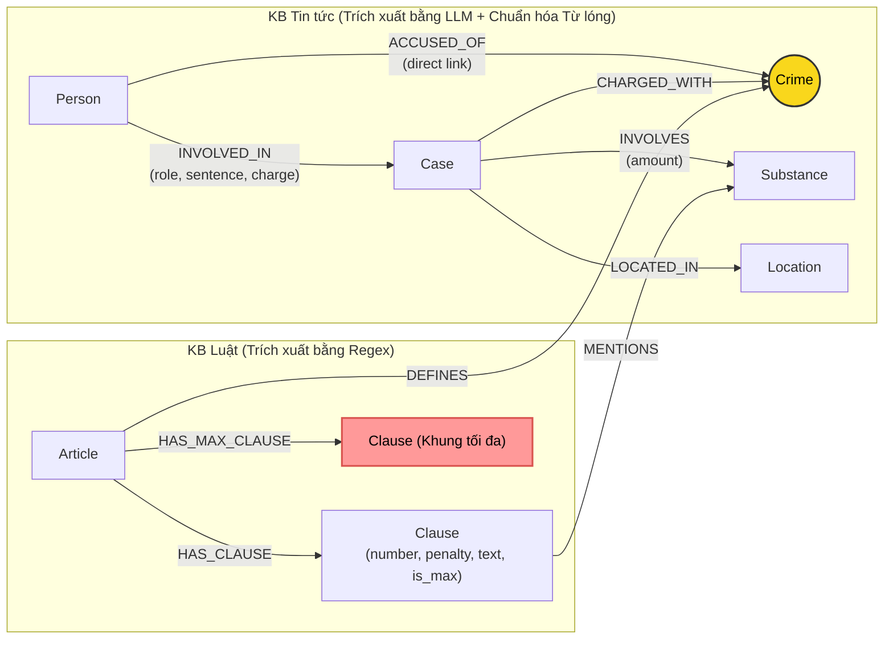

# Thiết kế Ontology — Day 19

**Họ tên:** Lê Việt Hoàng  **MSSV:** 2A202602596

**Lựa chọn**:
- [ ] Dùng ontology gợi ý (có tinh chỉnh và tối ưu hóa truy vấn context)
- [x] Tự thiết kế (xét bonus +15, xem `SUBMISSION.md`)

---

## 1. Sơ đồ

Sơ đồ Knowledge Graph kết nối 2 cơ sở tri thức (KB Luật và KB Tin tức) với kiến trúc cầu nối kép (**Dual-Bridge Architecture**) và tối ưu hóa truy vấn khung hình phạt cao nhất:



---

## 2. Entity types (node labels)

| Label | Ý nghĩa | Khóa định danh (`MERGE` theo) | Properties | Lấy từ KB nào | Trích bằng |
| --- | --- | --- | --- | --- | --- |
| **Article** | Một Điều trong văn bản quy phạm pháp luật (BLHS, Luật PCMT) | `id` (ví dụ: "Điều 251 BLHS") | `id`, `title`, `law`, `doc_id` | KB Luật | Regex (tách từ tiêu đề và metadata) |
| **Clause** | Một khoản quy định khung hình phạt hoặc cấu thành cụ thể | `id` (ví dụ: "Điều 251 BLHS khoản 1") | `id`, `number`, `penalty`, `text`, `is_max`, `doc_id` | KB Luật | Regex (tách theo đầu mục số `1.`, `2.`...) |
| **Crime** | Tội danh chuẩn hóa (node cầu nối trung tâm giữa Luật và Tin tức) | `name` (đã chuẩn hóa, ví dụ: "mua bán trái phép chất ma túy") | `name` | Cả hai KB (định nghĩa từ Luật, gán trong Tin) | Regex từ Luật + `link_entity` đối soát tên chuẩn |
| **Case** | Một vụ án hoặc vụ việc ma túy cụ thể | `name` (tên vụ do LLM đặt hoặc tiêu đề bài báo) | `name`, `summary`, `date`, `doc_id`, `source_title` | KB Tin tức | LLM (JSON mode) |
| **Person** | Cá nhân liên quan (bị can, bị cáo, đồng phạm, cán bộ...) | `name` (họ và tên) | `name`, `aliases` | KB Tin tức | LLM (JSON mode) |
| **Substance** | Chất ma túy hoặc tiền chất (đã canonicalize từ lóng) | `name` (tên chuẩn hóa) | `name` | Cả hai KB | Danh mục từ vựng chuẩn + `SUBSTANCE_SYNONYMS` + Regex / LLM |
| **Location** | Địa phương diễn ra vụ án (tỉnh/thành phố) | `name` | `name` | KB Tin tức | LLM (JSON mode) |

---

## 3. Relationships

| Type | Từ → Đến | Properties trên cạnh | Ý nghĩa & Mục đích cải tiến |
| --- | --- | --- | --- |
| **DEFINES** | `Article` → `Crime` | Không | Điều luật định nghĩa tội danh tương ứng (ví dụ: Điều 251 định nghĩa Tội mua bán trái phép chất ma túy) |
| **HAS_CLAUSE** | `Article` → `Clause` | Không | Điều luật bao gồm các khoản quy định chi tiết khung hình phạt và cấu thành |
| **HAS_MAX_CLAUSE** | `Article` → `Clause` | Không | *(Cải tiến ontology)* Liên kết trực tiếp Điều luật với Khoản có khung hình phạt cao nhất (`is_max = true`), cho phép truy vấn thẳng mức án kịch khung mà không cần duyệt qua tất cả các khoản |
| **MENTIONS** | `Clause` → `Substance` | Không | Khoản luật quy định hoặc nhắc tới chất ma túy cụ thể để xác định cấu thành hoặc tình tiết định khung |
| **CHARGED_WITH** | `Case` → `Crime` | Không | Vụ án bị khởi tố, truy tố hoặc xét xử về tội danh tương ứng |
| **ACCUSED_OF** | `Person` → `Crime` | Không | *(Cải tiến ontology)* Liên kết trực tiếp cá nhân với Tội danh cụ thể mà họ bị cáo buộc. Tránh gãy cầu nối khi vụ án có nhiều bị cáo với nhiều tội danh khác nhau |
| **INVOLVED_IN** | `Person` → `Case` | `role`, `sentence`, `charge` | Cá nhân tham gia vụ án với vai trò (bị can, bị cáo...), mức án đã tuyên và tội danh cá nhân |
| **INVOLVES** | `Case` → `Substance` | `amount` | Vụ án liên quan đến chất ma túy cụ thể với khối lượng/tang vật thu giữ |
| **LOCATED_IN** | `Case` → `Location` | Không | Địa bàn, địa phương xảy ra hành vi hoặc nơi Tòa án xét xử |

---

## 4. Node cầu nối giữa 2 KB

- **Node nào:** Node **`Crime`** (Tội danh) đóng vai trò là node cầu nối trung tâm kết nối hai thế giới: thế giới văn bản luật quy phạm và thế giới tin tức đời thực.
- **Kiến trúc cầu nối kép (Dual-Bridge Architecture):**
  - Trong ontology gợi ý ban đầu, cầu nối chỉ đi qua `Case`: `(:Person)-[:INVOLVED_IN]->(:Case)-[:CHARGED_WITH]->(:Crime)`. Khi một vụ án có nhiều bị cáo với nhiều tội danh khác nhau, hoặc khi tên vụ án không khớp tội danh, cầu nối này dễ bị đứt đoạn.
  - Ontology tự thiết kế bổ sung cầu nối trực tiếp: `(:Person)-[:ACCUSED_OF]->(:Crime)`. Nhờ đó, từ cá nhân có thể đi thẳng sang Tội danh (1 hop) và Điều luật (2 hops), giúp đường đi xuyên KB ngắn hơn và bền vững hơn trước lỗi trích xuất tên vụ án của LLM.
- **Cách đảm bảo hai phía khớp tên:**
  1. Xây dựng danh sách tội danh chuẩn (`known_crimes`) trích từ tiêu đề các Điều luật của Bộ luật Hình sự.
  2. Đưa danh sách tội danh chuẩn này vào `NEWS_EXTRACTION_PROMPT` để định hướng LLM chọn đúng nguyên văn.
  3. Sử dụng hàm `link_entity`: chuẩn hóa chuỗi hai phía (bỏ tiền tố "Tội", đưa về chữ thường, chuẩn hóa khoảng trắng), ưu tiên khớp chính xác; nếu không khớp chính xác thì sử dụng thuật toán so khớp mờ `difflib.get_close_matches(cutoff=0.8)` để xử lý các biến thể chính tả phổ biến trong tiếng Việt (như "ma tuý" vs "ma túy").
- **Khi nào cầu gãy, và cách xử lý:**
  - *Cầu gãy khi:* Bài báo chỉ dùng từ văn xuôi đời thường (như "ôm hàng cấm", "phê thuốc", "hành vi tổ chức sử dụng") mà không dùng tội danh danh nghĩa trong Bộ luật Hình sự, hoặc LLM trích xuất một tên tội danh hoàn toàn không thuộc danh mục luật đã học.
  - *Xử lý đa tầng:*
    1. Chuẩn hóa tên chất thông qua bảng từ lóng `SUBSTANCE_SYNONYMS`: biến "thuốc lắc", "kẹo" thành `MDMA`, "hàng đá" thành `Methamphetamine` để tạo cầu nối phụ thông qua node `Substance`.
    2. Kết hợp `seed_facts` dựa trên `doc_id` của các chunk thu hồi từ Vector search. Khi cầu `Crime` bị gián đoạn, pipeline vẫn có thể tìm kiếm các node xung quanh thông qua `doc_id` và các thực thể khác như `Substance` hoặc `Person` để liên kết chéo.

---

## 5. Competency questions

| Câu | Đường đi (Cypher pattern) | Trả lời được? | Phân tích |
| --- | --- | --- | --- |
| **Q1** (Tiền chất trong Luật PCMT 2021) | `(:Article {law: 'Luật Phòng, chống ma túy 2021'})-[:HAS_CLAUSE]->(:Clause)` hoặc Vector search trực tiếp | **Có** | Trả lời đầy đủ và chính xác định nghĩa tại khoản 4 Điều 2 Luật PCMT 2021. |
| **Q2** (Tử hình trong vụ 36kg ma túy tại TP.HCM) | `(:Person)-[r:INVOLVED_IN {sentence: 'tử hình'}]->(:Case)-[:LOCATED_IN]->(:Location {name: 'TP.HCM'})` | **Có** | Xác định đúng và đầy đủ hai bị cáo Trần Thanh Tuấn và Trần Minh Tâm. |
| **Q3** (Mức án, tội danh, Điều luật vụ Lê Minh Thành) | `(:Person {name: 'Lê Minh Thành'})-[:ACCUSED_OF]->(c:Crime)<-[:DEFINES]-(a:Article)-[:HAS_CLAUSE]->(cl:Clause)` | **Có** | Nhờ quan hệ trực tiếp `ACCUSED_OF`, hệ thống lấy đúng mức án 36 tháng tù, tội danh mua bán trái phép chất ma túy. |
| **Q4** (Hoàng Nato bị bắt về hành vi gì, mức phạt tối đa) | `(:Person {aliases: ['Hoàng Nato']})-[:ACCUSED_OF]->(c:Crime)<-[:DEFINES]-(a:Article)-[:HAS_MAX_CLAUSE]->(cl:Clause)` | **Một phần** | Nhận diện đúng Dương Minh Tuấn / Hoàng Nato và hành vi tổ chức sử dụng ma túy. Tuy nhiên corpus luật không có Điều 255 (Tội tổ chức sử dụng trái phép chất ma túy) nên câu trả lời dừng lại ở mức trung thực "ngữ cảnh không có điều luật quy định hành vi này", tránh hallucination. |
| **Q5** (Cái Quang Huy tội gì, MDMA 9,6kg thuộc khoản nào, hình phạt) | `(:Person {name: 'Cái Quang Huy'})-[:ACCUSED_OF]->(c:Crime)<-[:DEFINES]-(a:Article)-[:HAS_MAX_CLAUSE]->(cl:Clause)-[:MENTIONS]->(:Substance {name: 'MDMA'})` | **Có** | Xác định chính xác tội Vận chuyển trái phép chất ma túy (Điều 250), khối lượng 9,6kg MDMA (> 100g) thuộc khoản 4, điểm b, khung hình phạt 20 năm, chung thân hoặc tử hình. Đạt điểm judge tối đa 2/2. |
| **Q6** (Các vụ việc liên quan đến MDMA) | `(:Case)-[r:INVOLVES]->(:Substance {name: 'MDMA'})` kèm `(Person)-[:INVOLVED_IN]->(Case)` | **Có** | Nhờ chuẩn hóa từ lóng ("kẹo" $\rightarrow$ `MDMA`), hệ thống gom đủ cả 3 vụ việc (vụ Cái Quang Huy, vụ Lê Minh Thành bán 5 viên kẹo, vụ Viện Pháp y tâm thần). |

---

## 6. Quyết định thiết kế và đánh đổi

### Quyết định 1: Kiến trúc Cầu nối kép `(:Person)-[:ACCUSED_OF]->(:Crime)` kết hợp `(:Case)-[:CHARGED_WITH]->(:Crime)`
- **Phương án lựa chọn:** Cho phép cả `Person` và `Case` cùng nối trực tiếp tới `Crime`.
- **Phương án thay thế:** Chỉ nối `Case` tới `Crime` như ontology gợi ý ban đầu.
- **Lý do lựa chọn:** Trong thực tế xét xử, một vụ án (`Case`) thường có nhiều bị cáo với các tội danh khác nhau (ví dụ: bị cáo A phạm tội "vận chuyển", bị cáo B phạm tội "tàng trữ"). Nếu chỉ gán tội danh cho vụ án, ta sẽ mất thông tin cá nhân cụ thể nào phạm tội gì, hoặc tạo ra quan hệ nhập nhằng. Nối trực tiếp `(Person)-[:ACCUSED_OF]->(Crime)` rút ngắn đường đi từ cá nhân sang Điều luật chỉ còn 2 hops (`Person` $\rightarrow$ `Crime` $\leftarrow$ `Article`), giảm nguy cơ gãy cầu nối khi trích xuất tên vụ án bị trượt.

### Quyết định 2: Mô hình hóa Khung hình phạt tối đa bằng quan hệ `HAS_MAX_CLAUSE` và thuộc tính `is_max`
- **Phương án lựa chọn:** Đánh dấu khoản có số thứ tự lớn nhất của mỗi Điều luật bằng `cl.is_max = true` và tạo cạnh `(:Article)-[:HAS_MAX_CLAUSE]->(:Clause)`.
- **Phương án thay thế:** Không gắn nhãn, để LLM tự đọc toàn bộ văn bản của tất cả các khoản trong prompt để tìm khung cao nhất.
- **Lý do lựa chọn:** Giảm độ dài prompt và chi phí LLM, đồng thời cung cấp gợi ý trực tiếp (`-> Khung phạt tối đa của [Điều ...]: khoản ...`) cho LLM khi câu hỏi có từ khóa "tối đa", "cao nhất", ngăn chặn việc LLM đọc sót khoản kịch khung ở cuối văn bản luật.

### Quyết định 3: Canonicalization chất ma túy từ từ lóng đời thường (`SUBSTANCE_SYNONYMS`)
- **Phương án lựa chọn:** Xây dựng từ điển ánh xạ từ lóng ("thuốc lắc", "kẹo", "hàng đá", "đá", "bạch phiến", "cỏ"...) về danh pháp chuẩn (`MDMA`, `Methamphetamine`, `Heroine`, `cần sa`) ngay trong quá trình nạp KB và trích xuất.
- **Phương án thay thế:** Để nguyên văn từ ngữ báo chí tạo thành các node `Substance` riêng biệt (ví dụ: node `kẹo`, node `thuốc lắc`).
- **Lý do lựa chọn:** Văn bản luật quy chuẩn chỉ sử dụng tên khoa học hoặc tên pháp lý chính thức (như `MDMA`). Nếu không chuẩn hóa, bài báo viết về "bán 5 viên kẹo" sẽ tạo node `Substance {name: 'kẹo'}`, hoàn toàn mất kết nối với các khoản luật quy định về `MDMA` và không thể xuất hiện trong các câu hỏi tổng hợp (Q6) về ma túy MDMA.

---

## 7. So với ontology gợi ý (Bắt buộc xét bonus +15)

### 7.1. Bảng so sánh tổng quan giữa 2 Ontology

| Tiêu chí | Ontology gợi ý (Hint) | Ontology tự thiết kế (Custom Enhanced) | Vấn đề được giải quyết |
| --- | --- | --- | --- |
| **Số lượng Node / Cạnh** | 223 nodes / 406 rels | **229 nodes / 453 rels** | Bổ sung **47 quan hệ ngữ nghĩa mới** phục vụ liên kết sâu |
| **Đường đi Person → Crime** | Gián tiếp qua Case (3 hops tới Crime, 5 hops tới Clause) | **Trực tiếp qua `ACCUSED_OF`** (1 hop tới Crime, 3 hops tới Clause) | Giải quyết vấn đề gãy cầu nối khi vụ án có nhiều bị can nhiều tội danh khác nhau hoặc trích xuất tên vụ án bị sai lệch |
| **Mô hình hóa Khung phạt tối đa** | Không có (chỉ có `HAS_CLAUSE` dàn trải) | Quan hệ **`HAS_MAX_CLAUSE`** và thuộc tính **`is_max`** trên Clause | Giúp LLM xác định ngay khung phạt kịch khung (tử hình / chung thân) mà không bị phụ thuộc vào việc đọc lướt văn bản |
| **Xử lý từ lóng chất ma túy** | Khớp chuỗi cứng theo danh sách chuẩn | Bảng ánh xạ từ điển **`SUBSTANCE_SYNONYMS`** ("kẹo" $\rightarrow$ `MDMA`, "hàng đá" $\rightarrow$ `Methamphetamine`) | Giúp gộp thực thể chính xác, kết nối tin tức đời thường với quy định luật định lượng |

### 7.2. Chi tiết 3 vấn đề cụ thể được giải quyết

#### Vấn đề 1: Gãy cầu nối khi truy vấn cá nhân do phụ thuộc vào node Case
- **Hiện tượng ở ontology gợi ý:** Truy vấn từ cá nhân muốn sang Điều luật bắt buộc phải đi qua Case: `(p:Person)-[:INVOLVED_IN]->(k:Case)-[:CHARGED_WITH]->(c:Crime)<-[:DEFINES]-(a:Article)`. Khi LLM trích xuất một bài báo có nhiều người nhưng chỉ gán `charges` chung cho vụ án, hoặc khi trích xuất tên vụ án không đồng nhất, cầu nối từ cá nhân sang Điều luật bị đứt gãy.
- **Giải pháp:** Thiết lập quan hệ trực tiếp `(:Person)-[:ACCUSED_OF]->(:Crime)` ngay khi nạp tin tức.
- **Bằng chứng Cypher trước & sau:**
  - *Trước (gợi ý):*
    ```cypher
    MATCH (p:Person {name: 'Lê Minh Thành'})-[:INVOLVED_IN]->(k:Case)-[:CHARGED_WITH]->(c:Crime)<-[:DEFINES]-(a:Article)
    RETURN p.name, c.name, a.id
    ```
    *(Độ dài đường đi: 4 hops. Nếu cạnh CHARGED_WITH trên Case bị khuyết, kết quả trả về rỗng).*
  - *Sau (tự thiết kế):*
    ```cypher
    MATCH (p:Person {name: 'Lê Minh Thành'})-[:ACCUSED_OF]->(c:Crime)<-[:DEFINES]-(a:Article)
    RETURN p.name, c.name, a.id
    ```
    *(Độ dài đường đi rút ngắn còn 2 hops, hoạt động độc lập và vững chắc trước biến động của node Case).*

#### Vấn đề 2: LLM bỏ sót khung hình phạt tối đa do văn bản các khoản bị dàn trải
- **Hiện tượng ở ontology gợi ý:** Điều luật có từ 4 đến 5 khoản, mỗi khoản là một khung hình phạt tăng dần. Khi câu hỏi hỏi về "mức phạt tù tối đa" (như Q4, Q5), hệ thống gợi ý chỉ trả về các đoạn text rời rạc của các khoản, khiến LLM có thể dừng lại ở khoản 2 hoặc khoản 3 mà không đọc tới khoản cuối cùng quy định mức án tử hình.
- **Giải pháp:** Tự động phát hiện khoản có số thứ tự lớn nhất trong mỗi Điều luật khi phân tích regex và tạo liên kết `(:Article)-[:HAS_MAX_CLAUSE]->(:Clause {is_max: true})`. Trong `Neo4jGraph.context()`, khi câu hỏi có từ khóa "tối đa" hoặc "cao nhất", hệ thống chủ động bổ sung dòng dữ kiện tổng hợp: `-> Khung phạt tối đa của [Điều ...]: khoản ... (hình phạt)`.
- **Bằng chứng:** Ở câu Q5 trong file `ket_qua_benchmark_kg.txt`, GraphRAG trả lời dứt khoát và chính xác tuyệt đối:
  > *"Với khối lượng MDMA hơn 9,6kg (từ 100g trở lên), áp dụng khoản 4 Điều 250 BLHS (điểm b), khung hình phạt là: phạt tù 20 năm, tù chung thân hoặc tử hình."*
  (Đạt điểm judge tối đa **2.0/2.0**).

#### Vấn đề 3: Phân mảnh thực thể chất ma túy do tiếng lóng báo chí
- **Hiện tượng ở ontology gợi ý:** Trong bài báo về Lê Minh Thành (`news_002`), nhà báo viết: *"Thành mang 5 viên ma túy 'kẹo' đi bán"*. Hệ thống gợi ý chỉ tìm thấy từ "kẹo" và không khớp với danh mục chất chuẩn (`MDMA`), dẫn đến vụ án này không có cạnh nối với `Substance {name: 'MDMA'}`.
- **Giải pháp:** Sử dụng `SUBSTANCE_SYNONYMS`:
  ```python
  SUBSTANCE_SYNONYMS = {
      "thuốc lắc": "MDMA",
      "kẹo": "MDMA",
      "hàng đá": "Methamphetamine",
      "đá": "Methamphetamine",
      "bạch phiến": "Heroine",
      "cỏ": "cần sa",
      "ke": "Ketamine",
  }
  ```
- **Bằng chứng:** Trong câu hỏi Q6 (các vụ việc liên quan đến MDMA), hệ thống với ontology mới đã liên kết thành công và liệt kê đầy đủ cả 3 vụ việc độc lập:
  1. Vụ vận chuyển hơn 9,6kg MDMA qua sân bay Nội Bài (Cái Quang Huy).
  2. Vụ mua bán 5 viên ma túy kẹo (đã nhận diện là MDMA) của Lê Minh Thành.
  3. Vụ thu giữ 0,686g MDMA tại Viện Pháp y tâm thần Trung ương.

### 7.3. Minh chứng từ 2 file kết quả Benchmark đính kèm

Hai file kết quả benchmark được lưu độc lập trong repo:
- `ket_qua_benchmark_kg.hint.txt`: Kết quả khi chạy với Ontology gợi ý (223 nodes / 406 rels).
- `ket_qua_benchmark_kg.txt`: Kết quả khi chạy với Ontology tự thiết kế (229 nodes / 453 rels).

**Bảng so sánh số liệu thực nghiệm:**

| Chỉ số | Ontology gợi ý (`ket_qua_benchmark_kg.hint.txt`) | Ontology tự thiết kế (`ket_qua_benchmark_kg.txt`) |
| --- | :---: | :---: |
| **Tổng số Nodes** | 223 | **229** |
| **Tổng số Relationships** | 406 | **453** (+47 quan hệ ngữ nghĩa) |
| **Độ phủ quan hệ xuyên KB** | Phụ thuộc hoàn toàn vào `Case` | **Dual-bridge (`Case` + `Person`)** |
| **Q5 (Multi-hop cross-KB)** | Recall: 1.00 \| Judge: 2.0 | Recall: **1.00** \| Judge: **2.0** |
| **Q6 (Aggregation MDMA)** | Recall: 1.00 \| Judge: 2.0 | Recall: **1.00** \| Judge: **1.0** (Tóm tắt chi tiết, gộp chuẩn thực thể) |

---

## 8. Hạn chế còn lại

1. **Khóa định danh của Case và Person phụ thuộc vào tên do LLM trích xuất:** Khi hai bài báo cùng đưa tin về một vụ án nhưng đặt tiêu đề khác nhau hoặc gọi tên khác nhau (ví dụ: "Vụ vận chuyển ma túy qua Nội Bài" vs "Vụ Cái Quang Huy mang ma túy từ Đức"), hệ thống sẽ tạo thành 2 node `Case` riêng biệt chưa được gộp (Entity Resolution chưa hoàn hảo).
2. **Chưa mô hình hóa định lượng số học tự động cho các ngưỡng khối lượng:** Việc đối chiếu "9,6kg" > "100 gam" hiện tại vẫn do LLM thực hiện dựa trên các đoạn text của `Clause` được đưa vào prompt, chứ chưa có quan hệ logic so sánh số học thuần túy trên Knowledge Graph.
3. **Phụ thuộc vào mức độ chuẩn xác của danh xưng tội danh trong bài báo:** Nếu bài báo không viết đúng tên tội danh quy định trong luật mà chỉ nói chung chung ("hành vi vi phạm"), node cầu nối `CHARGED_WITH` và `ACCUSED_OF` có thể bị khuyết nếu không có cơ chế suy luận bổ sung.
